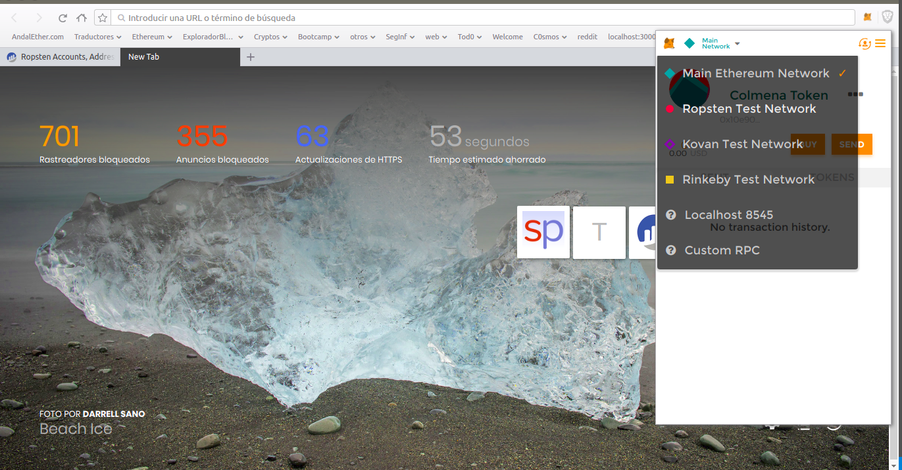
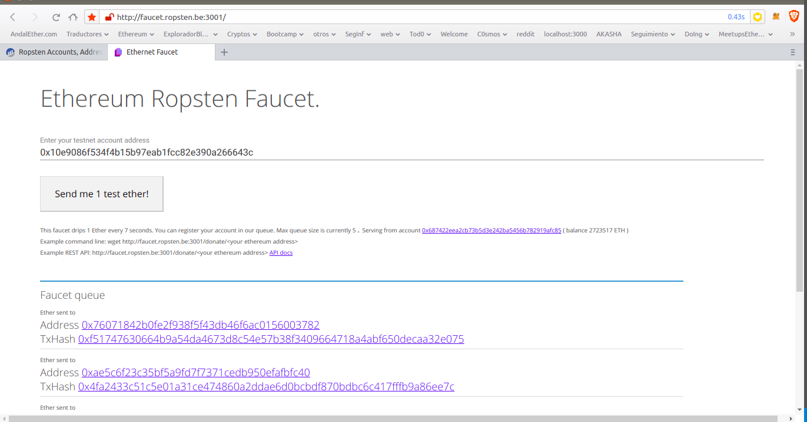
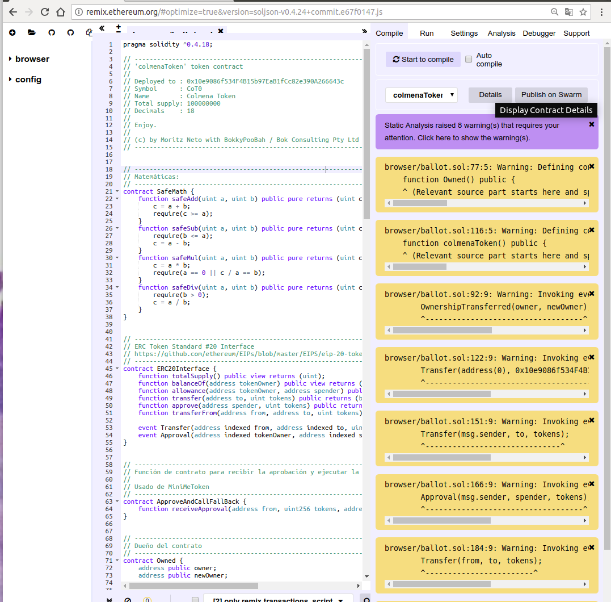
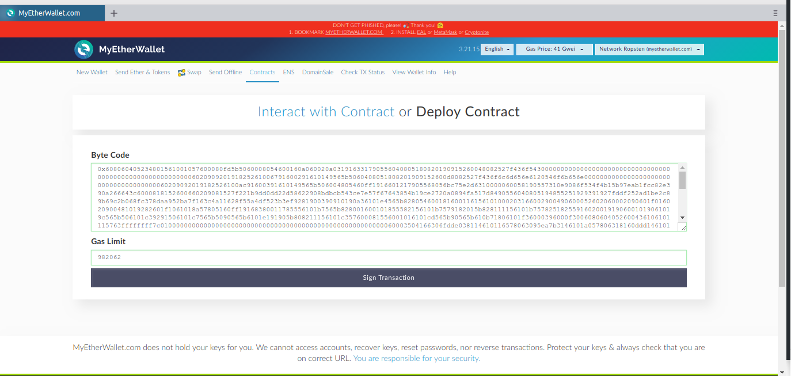
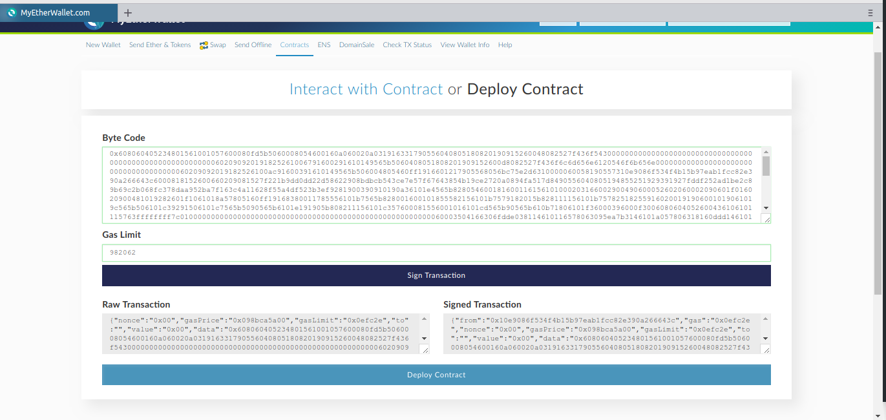
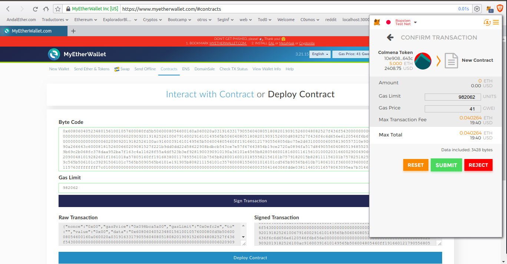
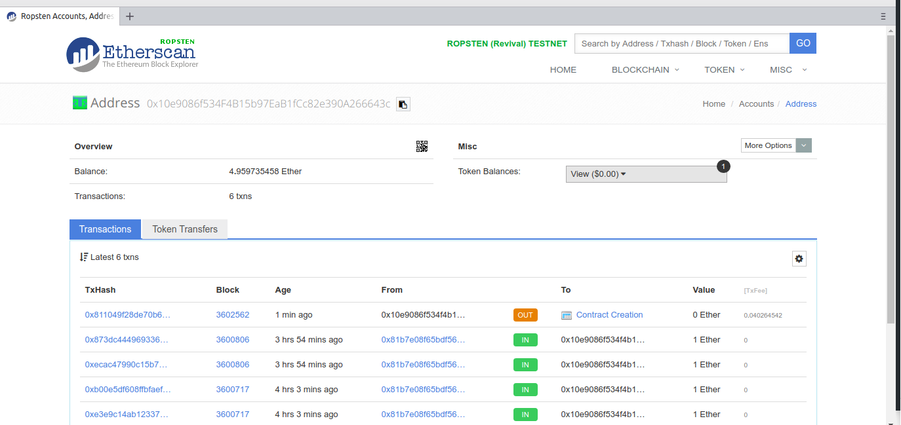
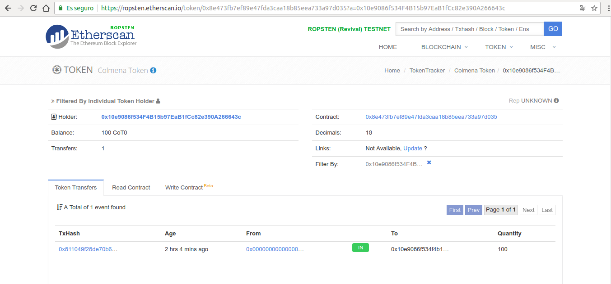

# Token-ERC20-creation
· Repositorio para el [meetup de Ethereum Sevilla](http://meetu.ps/e/Fx10g/wtQqS/a) que se usará en el workshop del día 12 de Julio para la creación de un token ERC20.
Esta guía esta basada en [este](https://github.com/bitfwdcommunity/Issue-your-own-ERC20-token/blob/master/contracts/erc20_tutorial.sol) smartContract, y en [esta](https://medium.com/bitfwd/how-to-issue-your-own-token-on-ethereum-in-less-than-20-minutes-ac1f8f022793) guía, de [Moritz Neto](https://medium.com/@netomoritz), modificando algunas cosas que con el paso del tiempo han cambiado.

· Usaremos [Metamask](https://metamask.io/) y la testnet de [Ropsten](https://ropsten.etherscan.io/) 

· En algunos momentos del proceso usaremos [My Ether Wallet](https://www.myetherwallet.com/)

· Pediremos algunos Ethers para la testnet, en [esta faucet](http://faucet.ropsten.be:3001/) o en [esta otra](https://faucet.metamask.io/).

· La dirección que vamos a usar es `0x10e9086f534F4B15b97EaB1fCc82e390A266643c`.

## Desplegando nuestro token ERC20 en la testnet de Ethereum:

### _¿Qué necesitamos?_

-1. Una wallet de Ethereum (en la testnet de Ropsten, por ejemplo).

-2. Algunos Ethers (como antes, de la testnet).

-3. Un editor de textos(Atom, Sublime...).

-4. Un contrato de Solidity.

·1: Para el tutorial usaremos la testnet de Ethereum llamada [Ropsten](https://ropsten.etherscan.io/); para ello, primero instalaremos el complemento del navegador [Metamask](https://metamask.io/), una vez instalado y con una contraseña segura, arriba en la izquierda cambiamos de `Main Network` a `Ropsten Test Network` 
       
 
    
·2: Entramos en [esta faucet](http://faucet.ropsten.be:3001/) o en [esta otra](https://faucet.metamask.io/) para pedir Ethers de la testnet de Ropsten.
        
  
    
·3: En nuestro editor de textos copiamos y pegamos [este](https://github.com/bitfwdcommunity/Issue-your-own-ERC20-token/blob/master/contracts/erc20_tutorial.sol) contrato escrito  en Solidity.

## Empecemos:
- Abrimos el contrato en nuestro editor de textos, desde la línea `3` hasta la `15`, en la sección comentada, tenemos toda la información necesaria para nuestro token, como puede ser, el nombre, el símbolo, la cantidad total y los decimales.

- Nos dirigimos a la línea `4` y cambiamos el nombre al que nosotros queramos.

- En la línea `6` cambiamos la wallet y ponemos la que hemos generado anteriormente de la testnet de Ropsten.

- En la línea `7` cambiamos el símbolo, debería ser corto.

- En la línea `8` cambiamos el nombre del token.

- Nos dirigimos a la línea `103` y cambiamos `_"FucksToken"_` por el nombre que le hayamos puesto a nuestro token.

- Hacemos lo mismo para la línea 116.

- En la línea `117` cambiamos el nombre del símbolo.

- Hacemos lo mismo para la línea `118`.

- En las líneas `121` y `122` ponemos la wallet que hemos generado anteriormente.

- Los decimales y el suministro total (líneas `119` y `120`), podemos dejarlo como está, respecto a la oferta total hay algunas consideraciones, el estándar y máximo es de 18 decimales, esto quiere decir que el token podrá dividirse en 18 partes.

- Nos dirigimos a [Remix Solidity IDE](http://remix.ethereum.org/).

- En `_browser/ballot.sol_` pegamos el código que acabamos de editar, si nos salen algunas alertas, no pasa nada, sólo son algunas alarmas; si queremos podemos buscar/corregir esas alarmas.

- Justo debajo de `_"Start to compile"_`, seleccionamos el token que acabamos de crear y hacemos clic en `_"detalles"_`.

    

- En la zona de `_"BYTECODE"_`, copiamos el valor de `_"object"_`.

- Nos dirigimos a [My Ether Wallet](https://www.myetherwallet.com/) con Metamask desbloqueado y nuestra wallet con fondos de la testnet, nos aseguramos que estamos en la red de pruebas Ropsten, o la que hayamos seleccionado, seleccionamos `_"contracts"_`  y `_"Deploy contract"_`.

- Una vez ahí, pegamos el codigo anterior y ponemos justo delante del mismo un `0x`, seleccionamos que se conecte a nuestra wallet usando _Metamask_ y hacemos clic en `_"Connect to Metamask"_`.

    

- Como hemos podido comprobar, el `_"Gas Limit"_` se ha rellenado con lo que necesita automáticamente.

- Hacemos clic en `_"Sign Transaction"_`.

    

- Repetimos haciendo clic en `_"Deploy Contract"_`.

- Si todo ha ido bien, Metamask debe tener un número 1 requiriendo nuestra atención, lo abrimos, y hacemos clic en `_"submit"_`

    

- Si buscamos nuestra wallet en un explorador de bloques, como por ejemplo [Etherscan.io](https://ropsten.etherscan.io/), e introducimos nuestra wallet, podemos ver la creación del contrato, y los tokens creados.

    

*Si hemos seguido estos pasos ya tenemos nuestro token ERC20 creado, solo tenemos que ir a cualquier explorador de bloques y buscar la wallet que ha creado el smartContract para ver la información sobre el mismo.*

    
